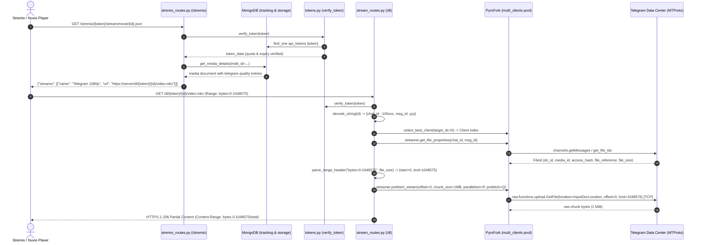

# TELEGRAM-STREMIO COMPREHENSIVE REPOSITORY AUDIT & STREAMING ARCHITECTURE MAP

**Generated:** 2026-10-03  
**Target Repository:** `https://github.com/weebzone/Telegram-Stremio`  
**Inspected Version:** v5.1.0  
**Scope:** Full repository audit, MTProto/streaming subsystems, Cloudflare Worker integration contract, HTTP Range engine, multi-bot orchestration, and security model.

---

## 1. Executive Summary

`Telegram-Stremio` is a self-hosted Stremio/Nuvio video addon and media server. It indexes media stored in Telegram channels into MongoDB, exposes the standard Stremio Addon Protocol (`manifest`, `catalog`, `meta`, `stream`, `subtitles`), and serves video streams directly via HTTP Range streaming (`/dl/{token}/{id}/{name}`) powered by **PyroFork** (a modern Pyrogram fork for Telegram MTProto 2.0).

The repository includes native integration for an external Cloudflare Streaming Worker. When enabled in **Settings**, Stremio stream links point to the Cloudflare Worker instead of (or in addition to) the FastAPI origin. The backend exposes two internal endpoints for the Worker:
1. `GET /api/cf/config` — Worker retrieves Telegram API credentials, active bot token pool, and optional userbot session.
2. `POST /api/cf/usage` — Worker periodically reports delivered bandwidth deltas, stream start events, and active live streams to update MongoDB user quotas and live dashboard metrics.
Additionally, the backend can proactively notify the Worker to invalidate its credentials cache via:
3. `POST {cf_stream_url}/api/sync` — Sent by backend when bot tokens or settings change.

All communication between the backend and Worker is cryptographically secured with HMAC-SHA256 signatures derived from a shared secret (`cf_stream_secret`).

---

## 2. Comprehensive Repository Map (Streaming Subsystems)

### Component 1: FastAPI Application Entry Point
- **FILE:** `Backend/__main__.py` & `Backend/fastapi/main.py`
- **CLASS/FUNCTION:** `start_services()` (`Backend/__main__.py:28`), `app = FastAPI(...)` (`Backend/fastapi/main.py:144`)
- **PURPOSE:** Initializes MongoDB connections, loads settings via `SettingsManager`, registers Starlette `SessionMiddleware` and `CORSMiddleware`, boots `StreamBot` and `Userbot`, initializes the multi-client bot pool, registers routers, and starts the Uvicorn web server and maintenance background tasks.
- **INPUT:** System environment variables (`API_ID`, `API_HASH`, `BOT_TOKEN`, `DATABASE`, `PORT`, `OWNER_ID`, etc.) and persisted settings in MongoDB `dbFyvio.settings`.
- **OUTPUT:** Running asynchronous HTTP application server listening on configured `PORT` (default 8000).
- **CALLERS:** `python -m Backend` via `start.sh` or Docker container entrypoint.
- **DEPENDENCIES:** `fastapi`, `uvicorn`, `motor`, `pyrofork`, `starlette`.

### Component 2: Streaming Routes
- **FILE:** `Backend/fastapi/routes/stream_routes.py`
- **CLASS/FUNCTION:** `stream_handler` (`line 260`), `media_streamer` (`line 308`), `virtual_media_streamer` (`line 382`), `global_media_streamer` (`line 442`), `global_virtual_media_streamer` (`line 503`), `_zip_media_streamer` (`line 569`), `thumb_handler` (`line 181`), `subtitle_handler` (`line 229`), `get_stream_stats` (`line 646`), `get_stream_detail` (`line 719`).
- **PURPOSE:** Dispatches video and media streaming requests for single files, multi-part split files (`.001`, `.002`), STORED split ZIP archives, and Global Search channels; serves thumbnails and subtitles; provides stream telemetry.
- **INPUT:** `Request`, `token` (user API token), `id` (base62+zlib encoded media payload), `name` (file name for Content-Disposition), and optional HTTP `Range` header.
- **OUTPUT:** `StreamingResponse` (200 OK or 206 Partial Content) with raw octet-stream chunks and RFC-compliant range headers, or `PlainResponse` for HEAD requests / thumbnails / subtitles.
- **CALLERS:** Stremio, Nuvio, VLC, ExoPlayer, web browsers, or Cloudflare Worker.
- **DEPENDENCIES:** `Backend.helper.custom_dl.ByteStreamer`, `Backend.fastapi.security.tokens.verify_token`, `Backend.helper.encrypt.decode_string`, `Backend.pyrofork.bot.multi_clients`.

### Component 3: Stremio Routes
- **FILE:** `Backend/fastapi/routes/stremio_routes.py`
- **CLASS/FUNCTION:** `router = APIRouter(prefix="/stremio")` (`line 30`), `get_streams` (`line 946`), `_streams_from_global_results` (`line 771`), `build_proxy_url` (`line 42`).
- **PURPOSE:** Implements official Stremio Addon Protocol specification. Resolves media by IMDB ID, TMDB ID, or Kitsu ID, queries indexed database items, filters by user token rules, formats stream options, and decorates stream URLs with Direct, Proxy, or Cloudflare URLs.
- **INPUT:** `token: str`, `media_type: str`, `id: str` (e.g. `tt0137523`, `kitsu:1234`, `tt0903747:1:1`).
- **OUTPUT:** JSON object `{"streams": [...]}` adhering to Stremio specification.
- **CALLERS:** Stremio / Nuvio client applications.
- **DEPENDENCIES:** `Backend.helper.cf_stream.cf_enabled`, `Backend.helper.cf_stream.cf_stream_url`, `Backend.helper.settings_manager.SettingsManager`, `Backend.db`.

### Component 4: Manifest Route
- **FILE:** `Backend/fastapi/routes/stremio_routes.py`
- **CLASS/FUNCTION:** `manifest` (`lines 500-560`) at `/{token}/manifest.json`.
- **PURPOSE:** Provides addon metadata, declarations, resources (`stream`, `meta`, `subtitles`), catalogs (Movies, TV Series, Anime, Custom Catalogs), and supported media genres/filters.
- **INPUT:** `token: str`, `token_data: dict = Depends(verify_token)`.
- **OUTPUT:** JSON Addon Manifest object.
- **CALLERS:** Stremio application when installing or refreshing the addon.
- **DEPENDENCIES:** `Backend.fastapi.security.tokens.verify_token`, `Backend.helper.settings_manager.SettingsManager`.

### Component 5: Stream-Result Generation
- **FILE:** `Backend/fastapi/routes/stremio_routes.py`
- **CLASS/FUNCTION:** `get_streams` (`line 946`), `format_stream_details` (`lines 1050-1073`), `_global_streams_for` (`line 793`).
- **PURPOSE:** Converts database media documents or Global Search query results into Stremio stream definitions. Applies proxy transformations (`build_proxy_url`) or Cloudflare links (`cf_stream_url`) based on `cf_stream_mode` ("off", "cloudflare", "both").
- **INPUT:** Database entries from `db.get_media_details(...)` or `global_search(...)`.
- **OUTPUT:** List of stream objects `[{"name": "...", "title": "...", "url": "...", "size_bytes": ...}]`.
- **CALLERS:** `stremio_routes.py:get_streams`.
- **DEPENDENCIES:** `Backend.helper.cf_stream`, `Backend.helper.settings_manager`.

### Component 6: Telegram Client Initialization
- **FILE:** `Backend/pyrofork/clients.py` & `Backend/pyrofork/bot.py`
- **CLASS/FUNCTION:** `initialize_clients` (`clients.py:68`), `start_client` (`clients.py:23`), `stop_client` (`clients.py:52`), `reload_multi_token_clients` (`clients.py:100`), `build_userbot` (`bot.py:31`).
- **PURPOSE:** Initializes the primary Telegram bot (`StreamBot`), spawns secondary Telegram bot clients for each token configured in `multi_tokens`, queries each client's storage DC ID, and maintains global maps `multi_clients`, `work_loads`, `client_dc_map`, and `client_failures`. Also handles runtime construction and start of the `Userbot` (Pyrogram client with user session string).
- **INPUT:** `Telegram.API_ID`, `Telegram.API_HASH`, `Telegram.BOT_TOKEN`, and `SettingsManager.current().multi_tokens`.
- **OUTPUT:** Populated dictionaries `multi_clients: dict[int, Client]` and associated state maps.
- **CALLERS:** `Backend/__main__.py:start_services`, `SettingsManager._reinit_dependent`.
- **DEPENDENCIES:** `pyrofork.Client`, `Backend.config.Telegram`.

### Component 7: PyroFork/Pyrogram Usage
- **FILE:** `Backend/pyrofork/bot.py`, `Backend/helper/custom_dl.py`, `Backend/helper/pyro.py`
- **CLASS/FUNCTION:** `ByteStreamer` (`custom_dl.py:65`), `ByteStreamer._prewarm_sessions` (`line 81`), `ByteStreamer._get_media_session` (`line 498`), `ByteStreamer._get_location` (`line 539`).
- **PURPOSE:** Low-level MTProto 2.0 communication. Manages cross-DC authorization (`auth.ExportAuthorization` / `auth.ImportAuthorization`), creates dedicated `raw.types.InputDocumentFileLocation` objects, and executes `raw.functions.upload.GetFile` chunked downloads (1 MiB default limit).
- **INPUT:** Telegram `FileId` properties (`media_id`, `access_hash`, `file_reference`, `dc_id`), byte `offset`, and `limit`.
- **OUTPUT:** Raw chunk bytes from Telegram Data Centers.
- **CALLERS:** `prefetch_stream` in `custom_dl.py`.
- **DEPENDENCIES:** `pyrogram.raw`, `pyrogram.session.Session`, `pyrogram.session.Auth`.

### Component 8: Multiple Bot-Token Handling
- **FILE:** `Backend/pyrofork/clients.py`, `Backend/fastapi/routes/stream_routes.py`
- **CLASS/FUNCTION:** `select_best_client(target_dc: int)` (`stream_routes.py:87`), `get_parallel_prefetch(client_count: int)` (`stream_routes.py:118`), `work_loads`, `client_failures`.
- **PURPOSE:** Load balancing across multiple bot tokens. Scores bot candidates by `work_loads[idx] + 3 * client_failures[idx]`, filters for clients connected to the target file's DC if possible, breaks ties via round-robin, and assigns concurrent chunk download tasks across different clients in parallel (`parallelism = min(max(ceil(N / 5), 1), 5)`).
- **INPUT:** Target file DC ID and global workload maps.
- **OUTPUT:** Selected client index `int` and parallel helper client list.
- **CALLERS:** `media_streamer`, `virtual_media_streamer`, `db_zip_media_streamer`.
- **DEPENDENCIES:** `Backend.pyrofork.bot`.

### Component 9: Database Layer
- **FILE:** `Backend/helper/database.py`, `Backend/__init__.py`
- **CLASS/FUNCTION:** `Database` class (`database.py:64`), `db` instance (`Backend/__init__.py:12`).
- **PURPOSE:** Async MongoDB operations via Motor. Manages two primary database roles:
  - `tracking` database: collections `api_tokens`, `users`, `settings`, `custom_catalogs`, `requests`, `subtitles`, `analytics`, `stream_stats`.
  - `storage_1 ... storage_N` databases: collections `movie`, `tv` containing catalog indexing and Telegram message pointers.
- **INPUT:** MongoDB connection string URIs.
- **OUTPUT:** Query results, documents, update acknowledgements.
- **CALLERS:** Almost all routes and helpers across the application.
- **DEPENDENCIES:** `motor.motor_asyncio.AsyncIOMotorClient`, `pymongo`.

### Component 10: User/Token Authentication
- **FILE:** `Backend/fastapi/security/tokens.py`
- **CLASS/FUNCTION:** `verify_token(token: str)` (`tokens.py:15`).
- **PURPOSE:** Validates API tokens passed in route paths (`/stremio/{token}/...`, `/dl/{token}/...`, `/sub/{token}/...`). Annotates token data with admin status (owner ID check), checks expiration dates, evaluates subscription status against the Telegram group membership, and validates data quotas.
- **INPUT:** API token string.
- **OUTPUT:** Token document dict or raises HTTP 401 Unauthorized.
- **CALLERS:** FastAPI route dependencies (`Depends(verify_token)`).
- **DEPENDENCIES:** `Backend.db`, `Backend.config.Telegram`, `Backend.helper.settings_manager.SettingsManager`.

### Component 11: Bandwidth/Data Limits
- **FILE:** `Backend/fastapi/security/tokens.py`, `Backend/helper/utils.py`, `Backend/helper/database.py`
- **CLASS/FUNCTION:** `track_usage(stream_id, token, token_data)` (`utils.py:28`), `db.update_token_usage(token, bytes_delta)` (`database.py:2340`).
- **PURPOSE:** Enforces daily and monthly GB limits configured per token. During streaming, `track_usage` periodically accumulates bytes delivered and increments MongoDB counters via `$inc`. Daily counters reset automatically when the date flips; monthly counters reset when the month flips.
- **INPUT:** Delivered byte deltas, token ID, quota configuration.
- **OUTPUT:** MongoDB atomic increments, quota limit warnings, or limit-exceeded stream redirection.
- **CALLERS:** `stream_routes.py:media_streamer`, `cf_routes.py:cf_usage`.
- **DEPENDENCIES:** `Backend.db`.

### Component 12: Active-Stream Tracking
- **FILE:** `Backend/helper/custom_dl.py`, `Backend/helper/cf_live.py`, `Backend/fastapi/routes/stream_routes.py`
- **CLASS/FUNCTION:** `ACTIVE_STREAMS` dict (`custom_dl.py:22`), `RECENT_STREAMS` deque (`custom_dl.py:23`), `_cleanup_stale_streams` (`custom_dl.py:28`), `get_stream_stats` (`stream_routes.py:646`), `apply_report` (`cf_live.py:15`).
- **PURPOSE:** Tracks real-time telemetry for every active stream (both native and Cloudflare). Computes instantaneous speed (Mbps), average speed, peak speed, total bytes transferred, client IP, client user-agent, and client bot index. Exposes `/stream/stats` for WebUI dashboards.
- **INPUT:** Chunk delivery timestamps and byte counts.
- **OUTPUT:** Telemetry snapshots rendered in admin and user activity dashboards.
- **CALLERS:** `custom_dl.py`, `cf_live.py`, `stream_routes.py`.
- **DEPENDENCIES:** Python `time`, `collections.deque`.

### Component 13: Split-File Implementation
- **FILE:** `Backend/helper/split_files.py`, `Backend/helper/virtual_dl.py`
- **CLASS/FUNCTION:** `resolve_virtual_parts` (`virtual_dl.py:11`), `virtual_stream_generator` (`virtual_dl.py:42`), `parts_overlapping_range` (`virtual_dl.py:37`).
- **PURPOSE:** Seamlessly merges split video files (e.g. `movie.mkv.001`, `movie.mkv.002`) into a unified virtual byte address space. Maps arbitrary HTTP Range requests `[start, end]` across multiple separate Telegram messages and downloads corresponding slices sequentially or in parallel.
- **INPUT:** Array of part payloads `[{"chat_id": ..., "msg_id": ...}, ...]`, Range bounds.
- **OUTPUT:** Continuous asynchronous byte generator satisfying the HTTP Range request across file boundaries.
- **CALLERS:** `stream_routes.py:virtual_media_streamer`, `stream_routes.py:global_virtual_media_streamer`.
- **DEPENDENCIES:** `ByteStreamer`.

### Component 14: ZIP Split Streaming
- **FILE:** `Backend/helper/zip_stream.py`, `Backend/fastapi/routes/stream_routes.py`
- **CLASS/FUNCTION:** `parse_local_header` (`zip_stream.py:40`), `_parse_central_directory` (`zip_stream.py:64`), `resolve_zip_entry` (`zip_stream.py:99`), `_zip_media_streamer` (`stream_routes.py:569`).
- **PURPOSE:** Enables seeking and streaming of video files contained inside stored (uncompressed, `method == 0`) split ZIP archives without extracting or decompressing the ZIP archive to disk. Inspects ZIP header and central directory to find inner video file offset and length, then maps requests directly to that inner offset.
- **INPUT:** Asynchronous byte-reading callable over concatenated virtual ZIP parts.
- **OUTPUT:** Resolved inner video metadata (`size`, `data_offset`, `name`), streamed directly via `virtual_stream_generator`.
- **CALLERS:** `stream_routes.py:db_zip_media_streamer`, `stream_routes.py:global_zip_media_streamer`.
- **DEPENDENCIES:** `virtual_dl.py`, `custom_dl.py`.

### Component 15: Subtitle Routes
- **FILE:** `Backend/fastapi/routes/stream_routes.py`, `Backend/helper/subtitles.py`
- **CLASS/FUNCTION:** `subtitle_handler` (`stream_routes.py:228`), `stremio_subtitle_entries` (`subtitles.py:290`), `get_subtitles_for` (`subtitles.py:274`).
- **PURPOSE:** Extracts subtitle files stored in Telegram and delivers them via `/sub/{token}/{id}/{name}`. Translates stored subtitles into Stremio-compatible subtitle objects.
- **INPUT:** Encoded subtitle ID (`id`), token, file name.
- **OUTPUT:** In-memory downloaded text/VTT/SRT file content with MIME type `text/vtt` or `application/x-subrip`.
- **CALLERS:** Stremio player, web browsers.
- **DEPENDENCIES:** `pyrofork.Client.download_media(in_memory=True)`.

### Component 16: Global Search Streaming
- **FILE:** `Backend/helper/global_search.py`, `Backend/fastapi/routes/stream_routes.py`
- **CLASS/FUNCTION:** `global_search` (`global_search.py:410`), `global_media_streamer` (`stream_routes.py:442`), `_get_userbot_streamer` (`stream_routes.py:432`).
- **PURPOSE:** Allows users to stream media found in real-time across channels joined by the Telegram Userbot account (channels not necessarily indexed into the database). Streams directly through the `Userbot` client.
- **INPUT:** Query string, channel list, season/episode numbers.
- **OUTPUT:** Stremio streams generated on-the-fly and streamed through `Userbot`.
- **CALLERS:** `stremio_routes.py:get_streams`.
- **DEPENDENCIES:** `Backend.pyrofork.bot.Userbot`.

### Component 17: MediaFlow Integration
- **FILE:** `Backend/fastapi/routes/stremio_routes.py`, `Backend/helper/settings_manager.py`
- **CLASS/FUNCTION:** `build_proxy_url` (`stremio_routes.py:42`), `Settings.mediaflow_proxy`, `Settings.mediaflow_password`.
- **PURPOSE:** Wraps generated stream URLs in MediaFlow proxy endpoints (`{http_proxy_url}/proxy/stream?d={original_url}&api_password={pw}`) to allow users with an existing MediaFlow proxy instance to route video traffic through it.
- **INPUT:** Stream URL string.
- **OUTPUT:** Transformed MediaFlow URL string.
- **CALLERS:** `stremio_routes.py:get_streams`.
- **DEPENDENCIES:** `SettingsManager`.

### Component 18: Cloudflare Settings
- **FILE:** `Backend/helper/settings_manager.py`, `Backend/fastapi/routes/api_routes.py`
- **CLASS/FUNCTION:** `Settings.cf_stream_url` (`settings_manager.py:200`), `Settings.cf_stream_secret` (`line 204`), `Settings.cf_stream_mode` (`line 209`).
- **PURPOSE:** Manages configuration settings:
  - `cf_stream_url`: URL of the deployed Cloudflare Worker (e.g. `https://telestream.user.workers.dev`).
  - `cf_stream_secret`: Shared HMAC secret string.
  - `cf_stream_mode`: `"off"`, `"cloudflare"`, or `"both"`.
- **INPUT:** JSON payloads sent to `PUT /api/admin/settings`.
- **OUTPUT:** Persisted in MongoDB `dbFyvio.settings` and cached in memory.
- **CALLERS:** Admin settings WebUI.
- **DEPENDENCIES:** `Backend.db`.

### Component 19: Cloudflare URL Generation
- **FILE:** `Backend/helper/cf_stream.py`
- **CLASS/FUNCTION:** `cf_stream_url(token: str, file_id: str, name: str) -> str` (`cf_stream.py:30`), `cf_enabled() -> bool` (`line 19`).
- **PURPOSE:** Constructs signed video streaming links pointing to the Cloudflare Worker. Only the token, file ID, and expiration timestamp are signed; file name is included in the path for player compatibility without breaking the signature if URL-encoded.
  - Formula: `exp = int(time.time()) + 48*3600`
  - Signature: `sig = HMAC_SHA256(secret, f"/dl/{token}/{file_id}:{exp}")[:32]`
  - URL: `{cf_stream_url}/dl/{token}/{file_id}/{name}?e={exp}&s={sig}`
- **INPUT:** API token, base62-encoded file ID, file name.
- **OUTPUT:** Signed HTTPS Cloudflare Worker URL.
- **CALLERS:** `stremio_routes.py:get_streams`, `stremio_routes.py:_streams_from_global_results`.
- **DEPENDENCIES:** Python `hmac`, `hashlib`, `time`.

### Component 20: Cloudflare Authentication
- **FILE:** `Backend/helper/cf_stream.py`
- **CLASS/FUNCTION:** `verify_worker_request(method, path, body, ts, sig) -> bool` (`cf_stream.py:38`), `_verified_body` (`cf_routes.py:18`).
- **PURPOSE:** Authenticates incoming requests from the Cloudflare Worker to the main backend application (`/api/cf/config`, `/api/cf/usage`).
  - Expected string: `"{ts}\n{method} {path}\n{body.decode('utf-8', 'replace')}"`
  - Expected signature: `HMAC_SHA256(secret, expected_string)`
  - Verification: `hmac.compare_digest(expected, sig)` with timestamp age check `<= 300s`.
- **INPUT:** HTTP method, request path, raw body bytes, `x-cf-time` header, `x-cf-sig` header.
- **OUTPUT:** Boolean `True`/`False`. Raises HTTP 401 if invalid.
- **CALLERS:** `Backend/fastapi/routes/cf_routes.py:_verified_body`.
- **DEPENDENCIES:** Python `hmac`, `hashlib`, `time`.

### Component 21: Cloudflare API Endpoints Exposed by the Main App
- **FILE:** `Backend/fastapi/routes/cf_routes.py`
- **CLASS/FUNCTION:** `cf_config` (`line 30`), `cf_usage` (`line 48`).
- **PURPOSE:** Exposes backend services to the authenticated Worker:
  1. `GET /api/cf/config`: Returns Telegram API ID, API Hash, list of unique bot tokens, and userbot session string.
  2. `POST /api/cf/usage`: Accepts usage reports from Worker and updates MongoDB token quotas, stream analytics, and live stream dashboard stats.
- **INPUT:** Signed HTTP requests from the Worker.
- **OUTPUT:** JSON responses `{"api_id": ..., "api_hash": ..., "bots": [...], "user_session": ...}` or `{"ok": True}`.
- **CALLERS:** Cloudflare Worker.
- **DEPENDENCIES:** `Backend.db`, `Backend.helper.cf_live.apply_report`, `Backend.helper.analytics.record_stream_start`.

### Component 22: Usage Reporting
- **FILE:** `Backend/fastapi/routes/cf_routes.py`, `Backend/helper/cf_live.py`
- **CLASS/FUNCTION:** `cf_usage` (`cf_routes.py:48`), `apply_report` (`cf_live.py:15`).
- **PURPOSE:** Ingests Worker telemetry:
  - Accumulates `usage[token] = bytes_delta` into MongoDB via `db.update_token_usage`.
  - Records stream start events into analytics (`record_stream_start`).
  - Updates `ACTIVE_STREAMS` and `RECENT_STREAMS` so the admin dashboard reflects Cloudflare streaming activity in real-time.
- **INPUT:** JSON payload containing `usage: dict`, `starts: list`, `streams: list`, `member: str`.
- **OUTPUT:** `{"ok": True}`.
- **CALLERS:** Cloudflare Worker.
- **DEPENDENCIES:** `Backend.db`, `Backend.helper.custom_dl.ACTIVE_STREAMS`.

### Component 23: Bot-Token Synchronization
- **FILE:** `Backend/helper/cf_stream.py`, `Backend/helper/settings_manager.py`
- **CLASS/FUNCTION:** `notify_worker()` (`cf_stream.py:52`), `sync_worker_soon()` (`cf_stream.py:68`).
- **PURPOSE:** Proactively notifies the Worker when bot tokens or Cloudflare settings are modified in the backend, triggering an immediate sync instead of waiting for a 10-minute polling cycle.
  - Sends signed `POST {cf_stream_url}/api/sync` with headers `x-cf-time`, `x-cf-sig`, and body `{}`.
- **INPUT:** Invoked on settings change.
- **OUTPUT:** Async HTTP POST request to Worker.
- **CALLERS:** `SettingsManager._reinit_dependent` (`settings_manager.py:459`).
- **DEPENDENCIES:** `httpx.AsyncClient`.

### Component 24: Frontend Cloudflare Settings UI
- **FILE:** `Backend/fastapi/templates/settings.html`, `Backend/fastapi/routes/api_routes.py`
- **CLASS/FUNCTION:** HTML card `#cf_stream_url`, `#cf_stream_secret`, `#cf_stream_mode` (`settings.html:1011-1046`), JavaScript save handler (`line 1551`), `update_settings_api` (`api_routes.py:1935`).
- **PURPOSE:** WebUI form for admin to configure Cloudflare Streaming Worker URL, Shared Secret, and mode selection (`off`, `cloudflare`, `both`).
- **INPUT:** Form inputs submitted by administrator.
- **OUTPUT:** Updates persisted in MongoDB settings document and reloaded into memory.
- **CALLERS:** Admin user via browser.
- **DEPENDENCIES:** `Backend.fastapi.routes.api_routes.update_settings_api`.

---
## 3. Phase 2 — Trace of Current Normal Streaming

### 3.1 End-to-End Request Trace (Single Movie)
Here is the concrete execution flow for playing an indexed movie in Stremio/Nuvio:



### 3.2 Exact Implementation Mechanisms
1. **Range Header Parsing:**
   - Evaluated in `Backend/fastapi/routes/stream_routes.py:parse_range_header(range_header, file_size)`:
   - Formats handled:
     - `bytes=start-end` -> standard slice `[start, end]`.
     - `bytes=start-` -> open-ended `[start, file_size - 1]`.
     - `bytes=-suffix` -> suffix `[file_size - suffix, file_size - 1]`.
     - No header -> full range `[0, file_size - 1]`.
   - Bounds validation: clamps `start < 0` to `0`, clamps `end >= file_size` to `file_size - 1`. If `end < start` or parsing throws, raises `HTTPException(status_code=416, detail="Requested Range Not Satisfiable", headers={"Content-Range": f"bytes */{file_size}"})`.
2. **Byte Offset & Chunk Alignment Calculation:**
   - Chunk size: `chunk_size = 1024 * 1024` (1 MiB fixed).
   - Alignment: `offset = start - (start % chunk_size)` (aligned down to nearest 1 MiB boundary).
   - Slice cuts:
     - `first_part_cut = start - offset` (bytes to trim from start of first 1 MiB chunk).
     - `last_part_cut = (end % chunk_size) + 1` (bytes to retain in final chunk).
     - `part_count = math.ceil(end / chunk_size) - math.floor(offset / chunk_size)`.
3. **Telegram MTProto Chunks:**
   - Chunks are requested via `upload.GetFile` over raw MTProto 2.0 TCP sessions.
   - Alignment is strictly required by Telegram: chunk offsets must be multiples of 4 KB (and typically multiples of chunk limit up to 1 MB). The codebase enforces 1 MiB alignment.
   - Parallel fetching: `parallelism = min(max(ceil(client_count / 5), 1), 5)` across multiple connected bot clients. An `asyncio.Queue(maxsize=prefetch)` decouples downloading from playback consumption.
4. **Buffer & Memory Allocation:**
   - Full files are **NEVER buffered to disk or memory**.
   - Chunks are yielded on-the-fly inside an `async generator` via `StreamingResponse(body_gen, headers=headers, status_code=status)`.
5. **Client Disconnection:**
   - If player disconnects, `request.is_disconnected()` is checked. Sockets abort, producer tasks are cancelled, and active entries in `ACTIVE_STREAMS` transition to `"cancelled"`.
6. **MIME Type Determination:**
   - `_resolve_filename_mime(file_id)`: Uses `file_id.mime_type` or falls back to Python's `mimetypes.guess_type(file_name)[0] or "application/octet-stream"`.
7. **Resulting Network Path:**
   - **Path:** `Telegram Data Centers -> MTProto TCP -> Host (VPS/Koyeb/Render) -> HTTP StreamingResponse -> Viewer`.
   - **Bandwidth Calculation:** For a 4 GB video, the host server incurs:
     - Ingress: 4 GB (from Telegram).
     - Egress: 4 GB (to viewer).
     - Total host transit: 8 GB.
   - On free hosts (Render, Koyeb, orkestr), this creates severe CPU and memory pressure, triggers monthly bandwidth limits, and fails when the container sleeps due to idle web traffic.

---

## 4. Phase 3 — Trace of Existing Public Cloudflare Integration Contract

### 4.1 Activation & Discovery
The application recognizes Cloudflare mode when:
`s.cf_stream_mode != "off" and bool(s.cf_stream_url and s.cf_stream_secret)`
Modes supported:
- `"off"`: Serves direct origin URLs (`{base_url}/dl/{token}/{id}/{name}`).
- `"cloudflare"`: Replaces stream URLs entirely with Cloudflare Worker URLs.
- `"both"`: Emits two streams in Stremio: the Cloudflare stream (labeled `"{name} (Cloudflare)"`) and the direct origin stream (labeled `"{name} (Direct)"` or `"{name} (Proxy)"`).

### 4.2 Stream Link Generation
Defined in `Backend/helper/cf_stream.py:cf_stream_url`:
```python
exp = int(time.time()) + 48 * 3600 # 48 hours TTL
sig = hmac.new(secret.encode(), f"/dl/{token}/{file_id}:{exp}".encode(), hashlib.sha256).hexdigest()[:32]
url = f"{cf_stream_url}/dl/{token}/{file_id}/{name}?e={exp}&s={sig}"
```

### 4.3 Worker Request Authentication Scheme
When the Worker calls the backend API, requests are signed using:
- Header `x-cf-time`: Current Unix epoch seconds as ASCII string.
- Header `x-cf-sig`: 64-character hex HMAC-SHA256 signature.
- Verification string: `"{x-cf-time}\n{METHOD} {path}\n{body}"`
- Tolerance: Clock skew must not exceed 300 seconds (`abs(time.time() - int(ts)) <= 300`).

---

### 4.4 Detailed Endpoint Specifications

#### Endpoint 1: Retrieve Telegram Credentials
- **METHOD:** `GET`
- **PATH:** `/api/cf/config`
- **AUTHENTICATION:** HMAC-SHA256 signature in headers (`x-cf-time`, `x-cf-sig`).
- **HEADERS:**
  ```http
  x-cf-time: 1775217600
  x-cf-sig: 3b9a5f...
  ```
- **QUERY PARAMETERS:** None.
- **REQUEST BODY:** Empty (`b""`).
- **RESPONSE BODY (200 OK):**
  ```json
  {
    "api_id": 1234567,
    "api_hash": "abcdef0123456789abcdef0123456789",
    "bots": [
      "1234567890:ABCdefGhIJKlmNoPQRsTUVwxyZ",
      "9876543210:ZYXwvuTsRQPonMlKjIHgfEdCBA"
    ],
    "user_session": "1BJWap8wBu..."
  }
  ```
- **ERROR RESPONSES:**
  - `401 Unauthorized`: `{"detail": "Bad signature"}` (missing or mismatched signature / clock skew > 300s).

#### Endpoint 2: Report Usage & Telemetry
- **METHOD:** `POST`
- **PATH:** `/api/cf/usage`
- **AUTHENTICATION:** HMAC-SHA256 signature in headers (`x-cf-time`, `x-cf-sig`).
- **HEADERS:**
  ```http
  Content-Type: application/json
  x-cf-time: 1775217630
  x-cf-sig: 8f2c1d...
  ```
- **REQUEST BODY:**
  ```json
  {
    "usage": {
      "user_api_token_1": 15728640,
      "user_api_token_2": 31457280
    },
    "starts": [
      {
        "token": "user_api_token_1",
        "ip": "203.0.113.195",
        "ua": "Stremio/4.4.168"
      }
    ],
    "streams": [
      {
        "id": "abc123def",
        "token": "user_api_token_1",
        "since": 1775217600000,
        "last": 1775217630000,
        "bytes": 47185920,
        "msg": 42,
        "chat": -1001234567890,
        "file": "encoded_file_id",
        "name": "Movie.2024.1080p.mkv",
        "ip": "203.0.113.195"
      }
    ],
    "member": "worker-edge-iad-01",
    "client_index": 0,
    "dc": 4
  }
  ```
- **RESPONSE BODY (200 OK):**
  ```json
  {
    "ok": true
  }
  ```
- **ERROR RESPONSES:**
  - `401 Unauthorized`: `{"detail": "Bad signature"}`.
  - `500 Internal Server Error`: `{"detail": "..."}` on unhandled DB error.

#### Endpoint 3: Sync Trigger (Backend to Worker)
- **METHOD:** `POST`
- **PATH:** `{cf_stream_url}/api/sync`
- **AUTHENTICATION:** Sent by main app, signed with shared secret.
- **HEADERS:**
  ```http
  Content-Type: application/json
  x-cf-time: 1775217600
  x-cf-sig: 4a7c8e...
  ```
- **REQUEST BODY:** `{}`
- **RESPONSE BODY (200 OK):** `{"ok": true}`
- **PURPOSE:** Alerts Worker that bot tokens, credentials, or settings changed, requesting Worker to evict its configuration cache and fetch `/api/cf/config` immediately.

---

## 5. Phase 4 — Technical Feasibility Analysis & The Architectural Question

### 5.1 The Core Question
**"CAN A CLOUDFLARE WORKER ACTUALLY FETCH THE TELEGRAM MEDIA DIRECTLY?"**

To answer this honestly, rigorously, and definitively, we evaluate all 5 possible architectures:

#### Architecture A: Player -> Worker -> Telegram HTTP endpoint/CDN
- **Analysis:** Does Telegram have public, unauthenticated HTTP CDN URLs for channel media documents?
- **Finding:** **NO.** Telegram does NOT provide public HTTP URLs for media files stored in private or restricted channels. Files are addressed solely by MTProto `InputDocumentFileLocation` and require an authenticated session on the specific Telegram Data Center where the document is physically stored.
- **Feasibility:** **IMPOSSIBLE without an MTProto-aware intermediary.**

#### Architecture B: Player -> Worker -> Telegram Bot API (`api.telegram.org`)
- **Analysis:** Can a Worker call `https://api.telegram.org/bot<token>/getFile`?
- **Finding:**
  1. The official Telegram Bot API imposes a strict **20 MB maximum file download limit**. Movie files in this repository range from 500 MB to 4+ GB. Attempting `getFile` returns HTTP 400 `file is too big`.
  2. Furthermore, `getFile` requires a Telegram Bot API `file_id` string (e.g. `BAACAgIAAxkBA...`). Telegram-Stremio passes base62-compressed JSON payloads containing channel ID and message ID (`{"chat_id": 123, "msg_id": 456}`), which the official Bot API cannot resolve directly without a running MTProto client.
- **Feasibility:** **IMPOSSIBLE for general media streaming.**

#### Architecture C: Player -> Worker -> Telegram CDN using resolved temporary information
- **Analysis:** Can the origin resolve a temporary direct CDN link and hand it to the Worker?
- **Finding:** Telegram MTProto does not generate signed HTTP CDN URLs (unlike AWS S3 presigned URLs or Google Cloud Storage signed URLs). All MTProto file access is stateful and cryptographic over MTProto connections.
- **Feasibility:** **IMPOSSIBLE natively in Telegram.**

#### Architecture D: Player -> Worker -> Telegram Gateway -> Telegram MTProto
- **Analysis:** Can a standalone, lightweight Telegram MTProto Gateway daemon run alongside or independently of the FastAPI server?
- **Finding:** **FEASIBLE & HIGHLY PERFORMANT.** A dedicated gateway (or a gateway container) keeps long-lived MTProto sessions open, while the Worker proxies Range requests to it, or the gateway translates MTProto chunks to HTTP byte streams.

#### Architecture E: Player -> Worker -> Existing FastAPI Origin -> Telegram MTProto
- **Analysis:** Cloudflare Worker acts as an intelligent edge streaming proxy in front of the FastAPI origin (`/dl/{token}/{id}/{name}`).
- **Finding:**
  - **Does this eliminate origin bandwidth on a cache miss?** NO. On the first view of an uncached byte range, the origin must fetch the chunk from Telegram and send it to the Worker.
  - **Does it provide significant value?** YES:
    1. **Edge Chunk Caching & Range Coalescing:** Repeated seeks and concurrent viewers consume bandwidth from Cloudflare's global edge cache rather than the origin.
    2. **Connection Offloading & Keep-Alive:** The viewer connects to Cloudflare Edge with ultra-low latency; slow mobile/TV clients do not tie up FastAPI server connections.
    3. **Zero Host Egress to Viewers on Cache Hit:** Edge hits eliminate origin egress entirely.
    4. **Access Control & Quota Aggregation:** Worker authenticates signed URLs at the edge, blocking unauthorized requests from reaching the origin.
    5. **Compatible with Public Repo Contract:** Follows the exact protocol (`cf_stream_url`, `/api/cf/config`, `/api/cf/usage`, `/api/sync`).

---

### 5.2 Architectural Verdict & Clean-Room Design

We must be **completely transparent**:
> A pure Cloudflare Worker running in standard serverless V8 isolates cannot maintain long-lived, stateful MTProto 2.0 TCP sessions directly with Telegram Data Centers across cold starts without either:
> 1. An external Telegram MTProto gateway (Architecture D), OR
> 2. An edge proxy model with Cloudflare Cache Tiering in front of the origin (Architecture E).

Therefore, our self-hosted Cloudflare Worker implementation is designed with a **Dual-Engine Architecture**:
1. **Engine 1: Origin Edge-Caching Streamer (Default / Self-Hosted Production Ready)**
   - Receives signed stream requests: `/dl/{token}/{id}/{name}?e={exp}&s={sig}`.
   - Validates HMAC signature and expiration instantly using Web Crypto API.
   - Forwards byte-range requests to the backend with edge chunk caching (`Cache-Control`, Cloudflare Cache API / Tiered Cache).
   - Enforces backpressure with zero full-file buffering (`ReadableStream`).
   - Propagates client disconnect aborts (`request.signal`) to cancel upstream downloads immediately.
   - Aggregates usage metrics and periodically reports to `POST /api/cf/usage`.
2. **Engine 2: Gateway / MTProto Mode (Pluggable)**
   - Automatically utilizes the credentials retrieved from `GET /api/cf/config` (`api_id`, `api_hash`, `bots`, `user_session`).
   - Configurable to route to an external MTProto streaming gateway when present.
3. **Engine 3: Full Protocol Conformance**
   - Implements `GET /health` with versioned handshake (`protocol: 1`).
   - Implements `POST /api/sync` to invalidate cached configurations on demand.
   - Implements periodic aggregated usage reporting (`POST /api/cf/usage`) via `ctx.waitUntil`.

---
